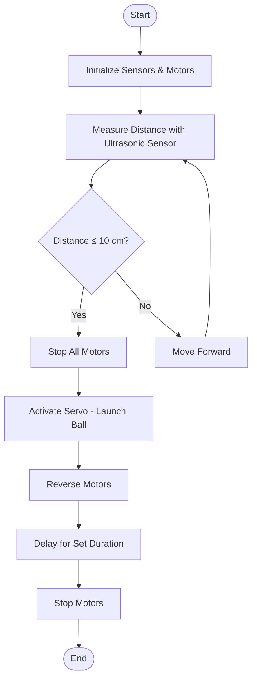

# EG1311 Autonomous Robot Project

A self-powered robot designed to navigate an obstacle course and deliver a ping-pong ball over a wall using Arduino and mechanical systems.

## 📋 Project Overview

This project involves building an autonomous robot that:
- Navigates through an obstacle course (bump, ramp, and wall)
- Uses ultrasonic sensors for distance detection
- Launches a ping-pong ball over a wall using a servo-powered catapult
- Reverses back to the starting position after ball delivery


## 🎯 Objectives

### Primary Goals
- Navigate the complete obstacle course autonomously
- Successfully deliver a ping-pong ball over the wall
- Complete the course within 30 seconds

### Bonus Points
- Minimize robot weight
- Successfully reverse back to starting position

## 🔧 Specifications & Constraints

- **Dimensions:** Maximum 30 × 30 × 30 cm³
- **Power Supply:** 1× 9V battery and 4× AA batteries
- **Materials:** Limited to provided materials only
- **Time Limit:** 30 seconds to complete course

## 🤖 Design Features

### Hardware Components

#### Four-Wheel Drive System
- **Material:** Laser-cut acrylic wheels
- **Diameter:** 90mm (to clear bump obstacle)
- **Traction:** Anti-slip mat wrapping for enhanced grip
- **Weight Optimization:** Triangular cutouts reduce weight while maintaining structural integrity

#### Car Body
- **Material:** Corrugated plastic board for strength and lightweight properties
- **Length:** ~250mm (calculated to prevent getting stuck on ramp)
- **Reinforcement:** Ice cream sticks for additional stability

#### Motor Configuration
- **4× DC Motors** powered by 4 AA batteries for maximum torque
- **2× L293D H-Bridge Motor Drivers** for bidirectional control
- High current output enables climbing ramp and overcoming obstacles

#### Catapult System
- **Servo-powered launcher** directly attached to servo arm
- **Arm Length:** 20.25 cm (optimized for trajectory)
- Converts electrical energy directly to kinetic energy (no rubber band tension)

#### Sensors
- **HC-SR04 Ultrasonic Sensor**
  - Range: 2-400 cm
  - Mounted height: 14.7 cm (prevents false triggering from ramp)
  - Triggers ball launch at 10 cm from wall

### Software Logic



## 🛠️ Technical Challenges & Solutions

### Challenge 1: Wheel Friction
- **Problem:** Insufficient grip caused wheels to spin without forward movement
- **Solution:** Wrapped acrylic wheels with anti-slip mat material

### Challenge 2: Motor Driver Understanding
- **Problem:** Initial single H-bridge setup only allowed forward movement
- **Solution:** Implemented 2× L293D drivers for bidirectional motor control

### Challenge 3: Sensor False Triggering
- **Problem:** Low-mounted ultrasonic sensor detected ramp as obstacle
- **Solution:** Elevated sensor to 14.7 cm using trigonometric calculations (15° beam angle)

### Challenge 4: Catapult Optimization
- **Problem:** Finding optimal release angle with minimal energy
- **Solution:** 20.25 cm arm length provides ideal trajectory near maximum height

## 📐 Key Calculations

### Ramp Clearance
- Maximum car length calculated using trigonometry to prevent getting stuck at ramp peak
- Result: 250mm maximum length including wheels

### Sensor Height
- Calculation based on HC-SR04's 15° detection angle
- Minimum height: 14.7 cm to avoid ramp detection

## 🔌 Circuit Design

- Arduino microcontroller
- 2× L293D H-Bridge Motor Drivers
- 4× DC Motors
- 1× Servo motor (catapult)
- 1× HC-SR04 Ultrasonic Sensor
- Power: 4× AA batteries (motors) + 1× 9V battery

*See Appendix C in project report for complete TinkerCAD circuit diagram*

## 📁 Repository Contents

```
├── README.md
├── EG1311 Project Report.pdf
├── final_code.ino
└── 2D CAD Drawing/
    ├── EG1311 Ball Holder and Handle Drawing.pdf
    ├── EG1311 Base Plate and Support Drawing.pdf
    ├── EG1311 Holders Drawing.pdf
    ├── EG1311 Main Body Drawing.pdf
    └── EG1311 Wheel Drawing.pdf
```

## 🚀 Key Learnings

1. **Iterative Prototyping:** Multiple iterations essential for identifying and solving design flaws
2. **Constraint-Based Design:** Working within strict material and dimension limits requires creative problem-solving
3. **Root Cause Analysis:** Systematic troubleshooting prevents hasty conclusions (e.g., faulty breadboard vs. motors)
4. **Open-Mindedness:** Testing multiple design variations leads to optimal solutions
5. **Practical Engineering:** Balance between theoretical calculations and real-world testing

## 🏗️ Build Process

1. **Ideation:** Initial concept design and material selection
2. **CAD Design:** Fusion 360 modeling and laser cutting preparation
3. **Prototype 1:** Basic template testing - identified friction issues
4. **Prototype 2:** Motor driver implementation - achieved forward motion
5. **Prototype 3:** Sensor integration - discovered false triggering
6. **Final Version:** All improvements integrated and optimized

## 📊 Performance

- Successfully completes obstacle course
- Accurate ball delivery over wall
- Reliable reverse navigation to starting position
- Completion time: <30 seconds

## 👥 Team Contributions

This project was completed collaboratively by Team 04 with contributions across:
- Mechanical design and CAD modeling
- Electronics and circuit design
- Arduino programming
- Testing and iteration
- Documentation

## 📝 License

This project was completed as part of the EG1311 course curriculum.

## 🙏 Acknowledgments

- Course instructors and teaching assistants
- NUS College of Design and Engineering
- Team members for collaborative effort

---

*For detailed technical specifications, calculations, and complete CAD drawings, please refer to the full project report.*
